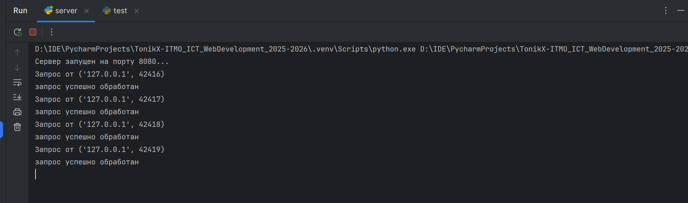
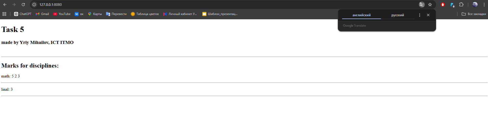

## Цель

Написать простой веб‑сервер для обработки **GET** и **POST** HTTP‑запросов с использованием библиотеки **socket**.  
Сервер должен уметь сохранять и отображать оценки по дисциплинам:

- через POST‑запрос добавляется дисциплина и оценка;
- через GET‑запрос отдаются все оценки в виде HTML‑страницы или JSON.

## Выполнение

В этой задаче я реализовал простой сервер, который принимает подключения и определяет метод запроса, чтобы затем либо отдать сгенерированную
html страницу с 200 кодом, либо распарсить параметры и добавить нужные данные в словарь оценок (при POST запросе), либо отдать 405 код с ошибкой о
том, что метод недоступен.

В качестве клиента для GET запросов я как и в 3 задаче использовал браузер и вводил путь 127.0.0.1:8080.

Для POST запросов я написал файл test.py (так как в браузере для этого надо было бы отдельно создавать форму), в котором использовал библиотеку requests для отправки простых POST запросов на сервер.


### Сервер

```python
import socket

notes = {}


def generate_html():
    global notes
    html_content = '''<!DOCTYPE html>
<html lang="en">
<head>
    <meta charset="UTF-8">
    <title>Data page</title>
</head>
<body>
    <h1>Task 5</h1>
    <h3>made by Yriy Mihailov, ICT ITMO</h3>
    <br>
    <hr>
    <h2>Marks for disciplines:</h2>'''

    if notes:
        for discipline, mark_list in notes.items():
            marks_str = " ".join(str(mark) for mark in mark_list)
            html_content += f'<p>{discipline}: {marks_str}</p><hr>'
    else:
        html_content += '<p>No marks(</p><hr>'

    html_content += '</body></html>'
    return html_content


server_socket = socket.socket(socket.AF_INET, socket.SOCK_STREAM)

server_socket.bind(('localhost', 8080))

server_socket.listen(5)
print("Сервер запущен на порту 8080...")

while True:
    client_connection, client_address = server_socket.accept()
    print(f'Запрос от {client_address}')

    request = client_connection.recv(1024)
    data = request.decode('utf-8')

    if request.startswith(b'GET'):
        html_content = generate_html()
        response = (
                "HTTP/1.1 200 OK\r\n"
                "Content-Type: text/html; charset=utf-8\r\n"
                f"Content-Length: {len(html_content)}\r\n"
                "\r\n" + html_content
        )
        client_connection.sendall(response.encode('utf-8'))

    elif request.startswith(b'POST'):
        lines = request.decode().split('\r\n')
        post_data = ""
        for i, line in enumerate(lines):
            if line == '' and i + 1 < len(lines):
                post_data = lines[i + 1]
                break
        if 'discipline=' in post_data and 'mark=' in post_data:
            params = post_data.split('&')
            discipline = None
            mark = None
            for param in params:
                if param.startswith('discipline='):
                    discipline = param[11:]
                elif param.startswith('mark='):
                    mark = param[5:]
            if discipline not in notes.keys():
                notes[discipline] = []
            notes[discipline].append(mark)

        else:
            response = "HTTP/1.1 400 Bad Request\r\n\r\nОтсутствуют параметры discipline или mark"
            client_connection.sendall(response.encode('utf-8'))
            client_connection.close()
            continue

        html = open("success.html", 'r').read()
        response = (
                "HTTP/1.1 200 OK\r\n"
                "Content-Type: text/html; charset=utf-8\r\n"
                f"Content-Length: {len(html)}\r\n"
                "\r\n" + html
        )
        client_connection.sendall(response.encode('utf-8'))

    else:
        response = "HTTP/1.1 405 Method Not Allowed\r\n\r\nMethod not supported"

    client_connection.close()
    print("запрос успешно обработан")
```

### Файл для POST запросов

```python
import requests

payload1 = {'discipline': "math", 'mark': "5"}
payload2 = {'discipline': "math", 'mark': "2"}
payload3 = {'discipline': "linal", 'mark': "3"}
payload4 = {'discipline': "math", 'mark': "3"}

response_post1 = requests.post("http://127.0.0.1:8080", data=payload1)
print(1)
response_post2 = requests.post("http://127.0.0.1:8080", data=payload2)
print(2)
response_post3 = requests.post("http://127.0.0.1:8080", data=payload3)
print(3)
response_post4 = requests.post("http://127.0.0.1:8080", data=payload4)
print(4)
print(response_post4.text)
```

## Результат

Перед проверкой GET запроса логично запустить тестовый файл, который запишет в журнал несколько оценок. При этом обработано также,
если оценок не будет совсем - выведется No marks.




При заходе в браузер по адресу сервера (http://localhost:8080/) пользователь видит HTML‑страницу с текущими оценками:




## Вывод

Реализован простой веб‑сервер на Python, который самостоятельно парсит запрос и в зависимости от его типа отдает нужные ответы с необходимыми заголовками.