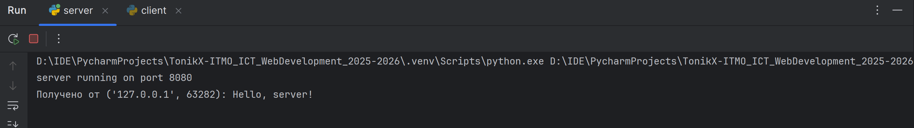
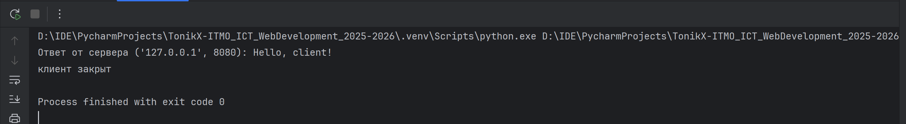

# Задача 1

## Цель

Реализовать клиентскую и серверную часть приложения с использованием библиотеки **socket** и протокола **UDP**.  
Клиент должен отправить серверу сообщение _«Hello, server»_, сервер выводит его у себя и отвечает _«Hello, client»_, которое отображается у клиента.

## Выполнение
В ходе выполнения были реализованы клиент и сервер, где:
- **Клиент** отправляет строку `"Hello, server!"` серверу по протоколу UDP.  
- **Сервер** принимает сообщение и выводит его в консоль.  
- В ответ сервер отправляет строку `"Hello, client!"`, которая отображается в консоли у клиента.  


### Клиент

```python
import socket

client_socket = socket.socket(socket.AF_INET, socket.SOCK_DGRAM)

server_address = ('localhost', 8080)
message = 'Hello, server!'
client_socket.sendto(message.encode(), server_address)

response, server_addr = client_socket.recvfrom(1024)
print(f'Ответ от сервера {server_addr}: {response.decode()}')

client_socket.close()
print('клиент закрыт')
```

### Сервер

```python
import socket

server_socket = socket.socket(socket.AF_INET, socket.SOCK_DGRAM)

server_socket.bind(('localhost', 8080))

print("server running on port 8080")

while True:
    data, client_address = server_socket.recvfrom(1024)
    print(f'Получено от {client_address}: {data.decode()}')

    response = "Hello, client!"
    server_socket.sendto(response.encode(), client_address)
```

## Результат

При запуске сервер ожидает сообщения.
На стороне клиента:

```
Hello, client!
```

На стороне сервера:

```
Hello, server!
```
Результаты работы после запуска обоих файлов:





## Вывод

Была успешно реализована простая клиент-серверная архитектура с использованием UDP-сокетов. Клиент отправляет сообщение серверу, сервер его принимает и отвечает клиенту.