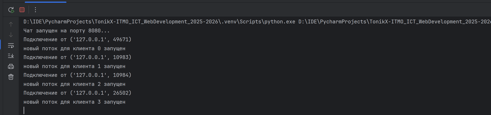
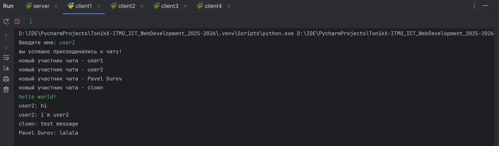
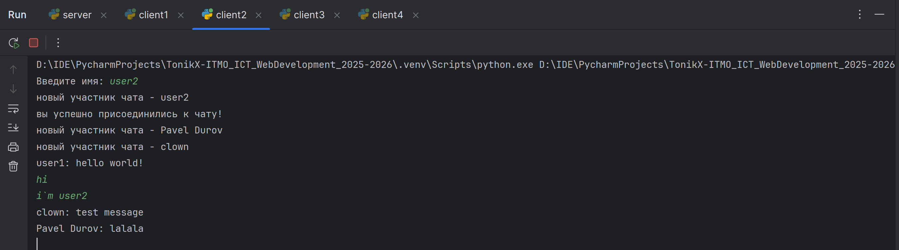
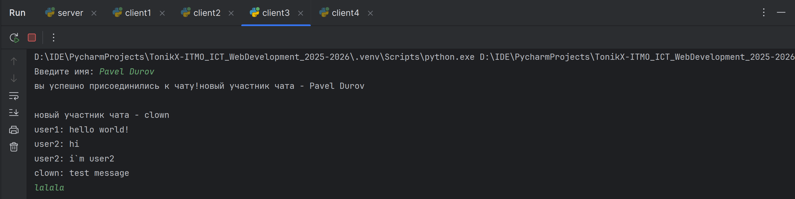

## Цель

Реализовать многопользовательский чат на базе **TCP-сокетов** с обработкой каждого клиента в отдельном потоке.  
Требования: использовать `socket` и для обработки нескольких подключений `threading`.

## Выполнение

Я сделал полноценный многопользовательский чат: один сервер принимает подключения нескольких клиентов и ретранслирует сообщения всем участникам.  

На сервере я создал отдельную функцию для подключения от клиента, чтобы потом каждое из них вынести в отдельный поток. Для хранения списка пользователей я создал простой List, а также добавил 
блокировку через `threading.Lock()`, чтобы не получить ошибки при параллельной обработке сообщений. Основной цикл по сути просто принимает
подключения и добавляет их в чат участников, а функция уже занимается непосредственно отправкой всех сообщений.

Также имеется обработка ситуации, когда какой-то клиент покидает чат. В этом случае он просто удаляется из списка `users` для рассылки.

На стороне клиента также используется `threading` для того, чтобы обрабатывать все получаемые от сервера сообщения. В основном цикле есть возможность написать сообщение и 
отправить по кнопке `Enter`. Таких клиентов я создал 4, чтобы можно было наглядно посмотреть как работает чат.

### Сервер (TCP + threading)

```python
import socket
import threading

users = []
k = 0

users_lock = threading.Lock()


def process_user(client_connection, client_address):
    global users
    while True:
        message = client_connection.recv(1024)

        with users_lock:
            for user in users:
                if user != client_connection:
                    try:
                        user.sendall(message)
                    except:
                        users.remove(user)


server_socket = socket.socket(socket.AF_INET, socket.SOCK_STREAM)

server_socket.bind(('localhost', 8080))

server_socket.listen(5)
print("Чат запущен на порту 8080...")


while True:
    client_connection, client_address = server_socket.accept()
    print(f'Подключение от {client_address}')

    with users_lock:
        users.append(client_connection)
    k += 1

    name = client_connection.recv(1024).decode()
    with users_lock:
        for user in users:
            user.sendall(f"новый участник чата - {name}".encode())

    t = threading.Thread(target=process_user, args=(client_connection, client_address))
    t.start()

    print(f"новый поток для клиента {k - 1} запущен")
```

### Клиент (TCP + threading)

```python
import socket
import threading


def process_recieve(client_socket):
    while True:
        response = client_socket.recv(1024).decode()
        print(response)


client_socket = socket.socket(socket.AF_INET, socket.SOCK_STREAM)

client_socket.connect(('localhost', 8080))

name = input("Введите имя: ")
client_socket.sendall(name.encode())

t = threading.Thread(target=process_recieve, args=(client_socket,))
t.start()

print("вы успешно присоединились к чату!")

while True:
    text = input()
    client_socket.sendall((name + ": " + text).encode())
```

### Результат

Сервер принимает все подключения:



Клиенты по очереди подключаются к чату. Также предлагается вести имя, которое будет видно при отправке сообщения. Все клиенты получают сообщения от других






## Вывод

Реализован многопользовательский чат по TCP с потоковой обработкой клиентов и безопасной рассылкой сообщений:

Сервер принимает неограниченное число подключений, каждое — в своём потоке.

Клиенты одновременно отправляют и получают сообщения благодаря отдельному потоку‑слушателю.

Состояние подключений защищено Lock, рассылка сделана без блокировок и с очисткой «мертвых» сокетов.