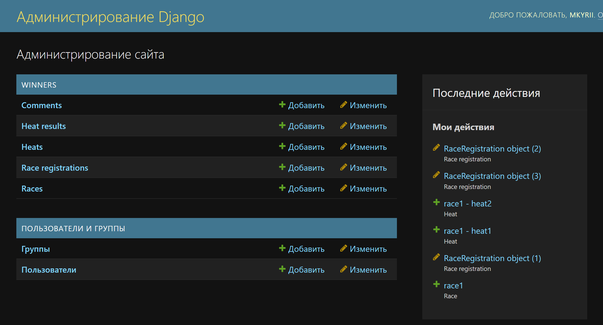
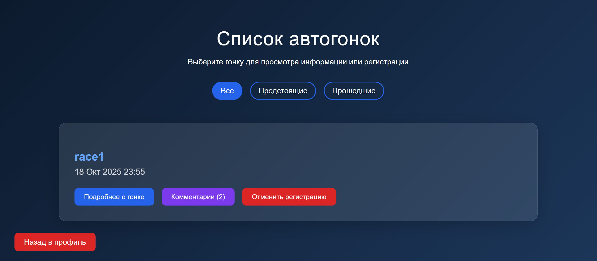
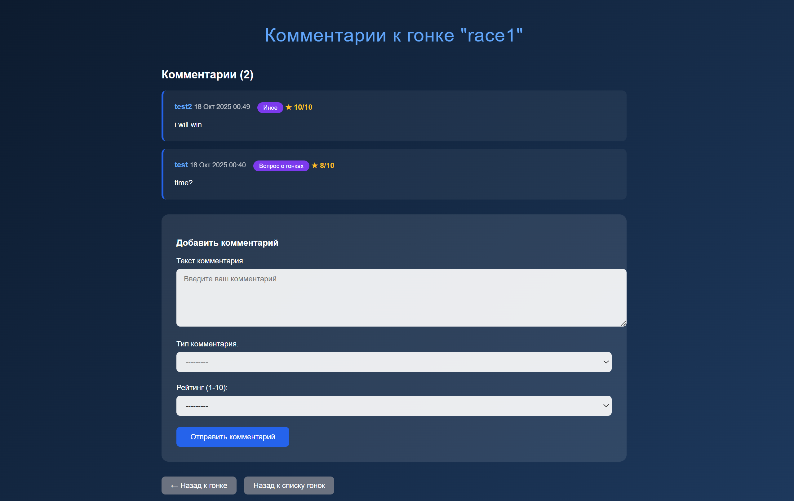

# Табло победителей автогонок

-----

## Задание:

Табло должно отображать информацию об участниках автогонок: ФИО участника,
название команды, описание автомобиля, описание участника, опыт и класс участника.
Необходимо реализовать следующий функционал:
- Регистрация новых пользователей.
- Просмотр автогонок и регистрацию гонщиков. Пользователь должен иметь
возможность редактирования и удаления своих регистраций.
- Написание отзывов и комментариев к автогонкам. Предварительно
комментатор должен зарегистрироваться. При добавлении комментариев
должны сохраняться даты заезда, текст комментария, тип комментария
(вопрос о сотрудничестве, вопрос о гонках, иное), рейтинг (1-10),
информация о комментаторе.
- Администратор должен иметь возможность указания времени заезда и
результата средствами Django-admin.
- В клиентской части должна формироваться таблица всех заездов и
результатов конкретной гонки.

## Ход выполнения

### Модели данных

Для начала была спроектирована основа приложения - модели данных.

* Racer хранит информацию о гонщике, связывая его с учетной записью пользователя, и содержит данные о его команде, автомобиле, опыте и классе.

* Race хранит информацию о гонке, такую как её название, описание и время проведения.

* Commentator хранит информацию о комментаторе, связывая его с учетной записью пользователя.

* RaceRegistration хранит информацию о регистрации гонщика на гонку, включая статус подтверждения и время регистрации. Гарантирует уникальность пары "гонщик-гонка".

* Comment хранит информацию о комментарии, оставленном комментатором во время гонки, включая его тип, текст, рейтинг и время создания.

* Heat хранит информацию о заезде в рамках гонки, включая его название, описание и время проведения.

* HeatResult хранит информацию о результате гонщика в конкретном заезде, а именно его итоговую позицию. Гарантирует уникальность пары "заезд-гонщик".

При этом профили гонщика и комментатора наследуются от встроенного User, что позволяет пользователю иметь разные функции под одной учетной записью

Также используется конструкция типа
``` 
def __str__(self):
    return self.user.username
```

Для понятного отображения сущности в БД.


### Формы

Были созданы формы на основе моделей, позволяющие регистрироваться под разными профилями, оставлять комментарии и записываться на гонки:

* Для регистрации новых пользователей применялась стандартная форма Django `UserCreationForm` с отключением проверки пароля.

```python
class BaseRegistrationForm(UserCreationForm):

    def __init__(self, *args, **kwargs):
        super().__init__(*args, **kwargs)
        for field in self.fields:
            self.fields[field].help_text = ''

        for fieldname in ['password1', 'password2']:
            self.fields[fieldname].validators = []

    class Meta:
        model = User
        fields = ['username', 'password1', 'password2']


class RacerProfileForm(forms.ModelForm):
    class Meta:
        model = Racer
        fields = ['team', 'car_description', 'racer_description', 'experience', 'classs']
        widgets = {
            'car_description': forms.Textarea(attrs={'rows': 3}),
            'racer_description': forms.Textarea(attrs={'rows': 3}),
        }
        labels = {
            'classs': 'Класс гонщика',
            'experience': 'Опыт (лет)',
        }


class CommentatorProfileForm(forms.ModelForm):
    class Meta:
        model = Commentator
        fields = []

class CommentForm(forms.ModelForm):
    class Meta:
        model = Comment
        fields = ['text', 'comment_type', 'rating']
        widgets = {
            'text': forms.Textarea(attrs={'rows': 4, 'placeholder': 'Введите ваш комментарий...'}),
            'rating': forms.Select(choices=[(i, i) for i in range(1, 11)]),
        }
        labels = {
            'text': 'Текст комментария',
            'comment_type': 'Тип комментария',
            'rating': 'Рейтинг (1-10)',
        }

class RaceRegistrationForm(forms.ModelForm):
    class Meta:
        model = RaceRegistration
        fields = []

class GenerateResultsForm(forms.Form):
    confirm = forms.BooleanField(
        required=True,
        label="Подтвердить генерацию результатов",
        help_text="Будут сгенерированы случайные результаты для всех зарегистрированных участников"
    )

```

### URL адреса и Пользовательский функционал

Для навигации по сайту и выполнения действий была настроена маршрутизация. При этом был сделан акцент на возможность сквозного перехода по страницам (кнопки "назад" и "выйти из профиля")

```
    path('', views.home, name='home'),
    path('register/', views.base_register, name='base_register'),
    path('login/', auth_views.LoginView.as_view(template_name='winners/login.html'), name='login'),
    path('logout/', auth_views.LogoutView.as_view(), name='logout'),

    path('choose-role/', views.choose_role, name='choose_role'),
    path('register/racer/', views.register_racer, name='register_racer'),
    path('register/commentator/', views.register_commentator, name='register_commentator'),

    path('profile/', views.profile, name='profile'),
    path('races/', views.races_list, name='races_list'),
    path('race/<int:race_id>/about/', views.race_about, name='race_about'),
    path('race/<int:race_id>/comments/', views.race_comments, name='race_comments'),
    path('race/<int:race_id>/register/', views.register_for_race, name='race_register'),
    path('race/<int:race_id>/unregister/', views.unregister_from_race, name='race_unregister'),
    path('race/<int:race_id>/results/', views.race_results, name='race_results'),
    path('heat/<int:heat_id>/generate_results/', views.generate_heat_results, name='generate_heat_results'),
```

### Представления

Логика работы приложения реализована с помощью Function Based Views.

Регистрация была реализована через базовые классы Django: LoginView, LogoutView

Все необходимые views применялись с декоратором **@login_required**, который гарантирует доступ только зарегистрированным пользователям

Также были реализованы служебные функции, например админ может сгенерировать случайные результаты для заезда (это полезно для тестов и быстрой демонстрации функционала ЛР)

```
@staff_member_required
def generate_heat_results(request, heat_id):
    heat = get_object_or_404(Heat, id=heat_id)

    if request.method == 'POST':
        registrations = RaceRegistration.objects.filter(
            race=heat.race,
            is_confirmed=True
        ).select_related('racer')

        if not registrations:
            return redirect('race_results', race_id=heat.race.id)

        HeatResult.objects.filter(heat=heat).delete()

        racers = [reg.racer for reg in registrations]
        random.shuffle(racers)

        for position, racer in enumerate(racers, 1):
            HeatResult.objects.create(
                heat=heat,
                racer=racer,
                position=position
            )

        return redirect('race_results', race_id=heat.race.id)
```
### Панель администратора

Необходимые модели были зарегистрированы в админ-панели Django, что позволяет администратору легко управлять гонками, добавлять и редактировать время и результаты заездов.

Также админ может подтверждать регистрации участников на гонку





### Другие моменты

* Были реализованы пагинация и фильтры на страницах с гонками и их результатами

* На странице с информацией о гонке можно посмотреть список участников

### Скриншоты сайта

Страница профиля гонщика


Страница списка гонок. Если из больше 3, включается пагинация


Страница с комментариями о гонке


Страница с результатами о гонке. Если заездов много, также используется пагинация
